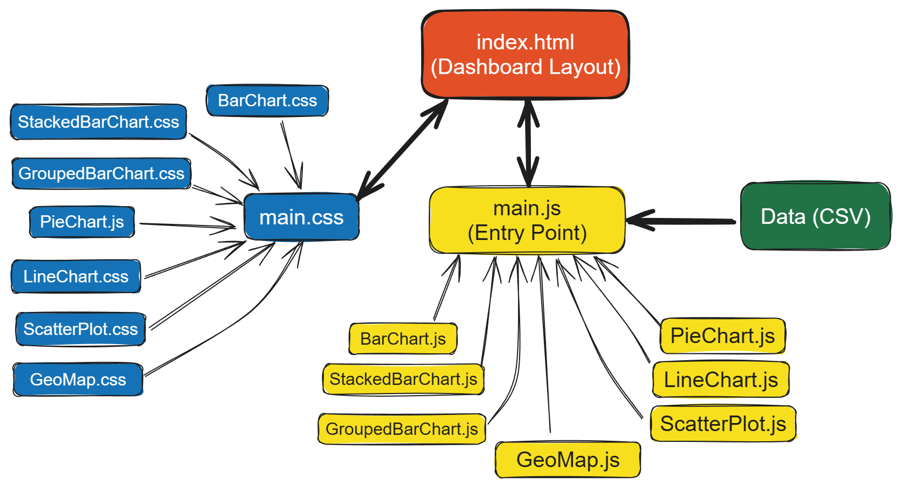

<!-- omit from toc -->
# F20DV Group Project

<!-- omit from toc -->
## Course: Data Visualisation and Analytics ([F20DV](https://curriculum.hw.ac.uk/coursedetails/F20DV?termcode=202324))

<!-- omit from toc -->
## Interactive Visualization Dashboard

  <!-- HTML -->
  
  <!-- CSS -->
  
  <!-- JavaScript -->
  
  <!-- D3.js -->
  

<!-- omit from toc -->
#### Download Cleaned Dataset Link and supporting TopoJSON files: [OneDrive Link](https://heriotwatt-my.sharepoint.com/:f:/g/personal/cr2007_hw_ac_uk/Ei8tz5LChLJEmToXVqjH52MBW_YIYwKRCPw6s-HouRc9mg?e=uETYGK)

---

<!-- omit from toc -->
### Group 10

Team Members:

- Abdul Rehman - @ar225
- Ahmed ElZubair - @ae87
- Chandrashekhar Ramaprasad - @cr2007
- Tamir Forawi - @tf2008

---

<!-- omit from toc -->
## Index

- [Introduction](#introduction)
- [Setup](#setup)
- [Architecture](#architecture)
  - [Directory Structure](#directory-structure)
  - [Data Processing](#data-processing)
  - [Event Handling](#event-handling)
  - [Charts](#charts)
  - [Styling](#styling)
  - [HTML Structure](#html-structure)

---

## Introduction

As part of our university coursework, we were tasked with designing and developing an interactive visualization application for the dataset of our choice, using HTML, CSS, JavaScript, and the [D3.js](https://d3js.org/) library.

The dataset we chose for this project is the [Electric Vehicles Population Dataset](https://www.kaggle.com/datasets/yashusinghal/electric-vehicle-population-dataset), a publicly available Kaggle dataset that contains information about electric vehicles (EVs) in the United States of America (USA). 
It includes data such as the Make, Model, State, Electric Vehicle Type, and the Electric Range of the vehicles.

## Setup

This setup guide is primarily for users of [Visual Studio Code](https://code.visualstudio.com/). If you're using a different code editor, ensure you have a local web server package like [XAMPP](https://www.apachefriends.org/) installed.

Ensure the following are installed on your machine:

- [Visual Studio Code](https://code.visualstudio.com/)
- [Git](https://git-scm.com/)

To set up the application:

1. Clone the repository: `git clone https://gitlab-student.macs.hw.ac.uk/cr2007/f20dv-group-project`. Alternatively, download the ZIP file from the "Code" button.
2. Open the project in Visual Studio Code.
3. Install the recommended extensions in [`.vscode/extensions.json`](./.vscode/extensions.json). Ensure the Live Server extension is installed.
4. Open `index.html` and click "**Go Live**" to run the application on a local server.
5. The application will open in your default web browser at [`http://localhost:5500`](http://localhost:5500).
6. Interact with the application and view the visualizations.
7. Changes to the code will reflect in the browser in real-time.

## Architecture

  

The application is a data visualization dashboard for electric vehicle data. It uses [D3.js](https://d3js.org/) for creating various types of charts and vanilla JavaScript for data processing and event handling. 
The application is styled using CSS and the layout is created using HTML.

### Directory Structure

The project is structured as follows:

- [`data/`](./data/): Constains the [CSV data file](./data/Electric_Vehicle_Population_Data_Cleaned.csv) used for generating the charts.
- [`lib/`](./lib/): Contains the D3.js library file [`d3.v7.min.js`](./lib/d3/d3.v7.min.js)
- [`scripts/`](scripts/): Constains JavaScript file s for each type of chart, connected by the main script file:
  - [`main.js`](./scripts/main.js): Handles data loading, processing, and event handling
  - [`barChart.js`](./scripts/barChart.js): Implementation of the Bar Chart
  - [`pieChart.js`](./scripts/pieChart.js): Implementation of the Pie Chart
  - [`stackedBarChart.js`](./scripts/stackedBarChart.js): Implementation the Stacked Bar Chart
  - [`lineChart.js`](./scripts/lineChart.js): Implementation of the Line Chart
  - [`scatterPlot.js`](./scripts/scatterPlot.js): Implementation of the Scatter Plot
  - [`groupedChart.js`](./scripts/groupedChart.js): Implementation of the Grouped Bar Chart
  - [`map.js`](./scripts/map.js): Implementation of the Map Chart
  - [`helper.js`](./scripts/helper.js): Reusable functions that have been used throughout the development of the charts
- [`styles/`](./styles/): Contains CSS files for each type of chart and the [main CSS file](./styles/main.css):
  - [`main.css`](./styles/main.css): Contains the main style and imports other CSS files
- [`index.html`](./index.html): The main HTML file that includes the D3.js library, the main CSS file and placeholders for the charts

---

### Data Processing

The CSV data is loaded and processed in `main.js` via the [`d3.csv()`](https://d3js.org/d3-fetch#csv) function.

The data processing functions transform the raw data into a format suitable for each type of chart. 
The processed data is then passed to the corresponding chart's render function.

### Event Handling

The event handling is also done in the [`main.js`](./scripts/main.js) file.

For example, it includes an event listener for the search input field. 
When the user types in the search input field, the data is filtered based on the search query and the charts are updated accordingly.

### Charts

Each chart is implemented as a class in its own JavaScript file.

The classes include a `render` function that takes the processed data and generates the chart.

### Styling

The application is styled using CSS. The [main CSS file](./styles/main.css) includes styles for the overall layout and imports the CSS files for each type of chart.

### HTML Structure

The [main HTML file](./index.html) includes the D3.js library, the main CSS file, and placeholders for the charts.

The placeholders are `div` elements with specific IDs corresponding to each type of chart.

---
